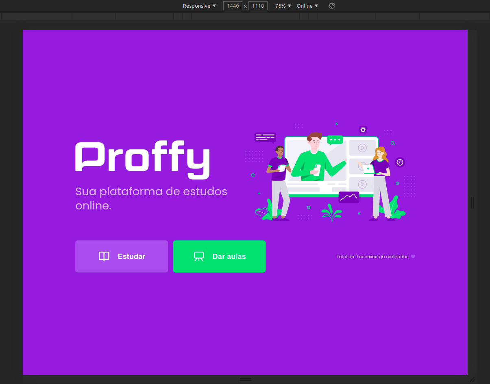
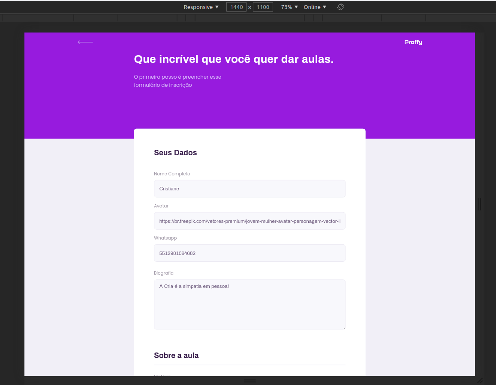

<h1 align="center">
    
</h1>

<h4 align="center"> 
	:heavy_check_mark: 🚀 Plataforma de ensino Proffy - NWL2 :heavy_check_mark:
</h4>

<p align="center">
  <a href="#-projecto">Projeto</a>&nbsp;&nbsp;&nbsp;|&nbsp;&nbsp;&nbsp;
  <a href="#rocket-Tecnologias">Tecnologias</a>&nbsp;&nbsp;&nbsp;|&nbsp;&nbsp;&nbsp;
  <a href="#information_source-como-usar">Como usar</a>&nbsp;&nbsp;&nbsp;|&nbsp;&nbsp;&nbsp;
  <a href="#-como-contribuir">Como contribuir</a>&nbsp;&nbsp;&nbsp;|&nbsp;&nbsp;&nbsp;
  <a href="#memo-license">Licença</a>
</p>

## 💻 Projeto

<p>Projeto de estudos siguindo a trilha NWL2 da Rocketseat. Bem mais simples comparado as trilhas GoStack, mas bom o suficiente para pegar mais alguns detalhes de Node JS, React JS, e React Native.  </p>

<p align="center">   
  
   
     
   
 </p>


## :rocket: Tecnologias

Esse projeto foi desenvolvido com as seguintes tecnologias:

- [ReactNative](https://reactnative.dev/) 
- [Typescript](https://www.typescriptlang.org/docs/home.html)
- [TypeORM](https://typeorm.io/#/)
- [Mutter](https://www.npmjs.com/package/multer)
- [Context API](https://reactjs.org/docs/context.html)
- [Async Storage](https://github.com/react-native-community/async-storage)
- [Mongodb](https://docs.mongodb.com/)
- [Redis](https://redis.io/documentation)
- [Postgres](https://www.postgresql.org/docs/)

## :information_source: Como Usar

Para clonar a aplicação, você necessitará do [Git](https://git-scm.com), [ReactNative][reactnative] + [Yarn][yarn] instalados em seu computador.

From your command line:

### Install API
```bash
# Clone this repository
$ git clone https://github.com/ApoOliveira18/app-GoBarber.git
# Go into the repository
$ cd app-GoBarber/

# Install dependencies for directories
$yarn

```

## 🤔 Como Contribuir

- Make a fork;
- Create a branck with your feature: `git checkout -b my-feature`;
- Commit changes: `git commit -m 'feat: My new feature'`;
- Make a push to your branch: `git push origin my-feature`.

After merging your receipt request to done, you can delete a branch from yours.

## :memo: License

Este projeto está sob licença MIT. Veja a [LICENSE] para mais informações.

---

Feito com ♥ && 🎧 && 😊 || 😥 
 por Adilson Oliveira :wave: [Get in touch!] www.linkedin.com/in/adilson-p-oliveira

[nodejs]: https://nodejs.org/
[yarn]: https://yarnpkg.com/
[vc]: https://code.visualstudio.com/
[vceditconfig]: https://marketplace.visualstudio.com/items?itemName=EditorConfig.EditorConfig
[vceslint]: https://marketplace.visualstudio.com/items?itemName=dbaeumer.vscode-eslint
[prettier]: https://marketplace.visualstudio.com/items?itemName=esbenp.prettier-vscode
[reactnative]: https://reactnative.dev/
[typescript]: https://www.typescriptlang.org/docs/home.html


